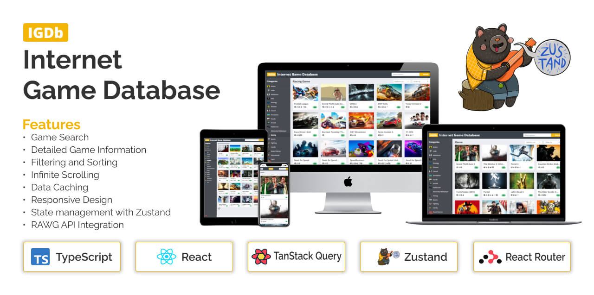

# IGDb | Internet Game Database



IGDb (Internet Game Database) is an advanced React application designed to meet the needs of users seeking in-depth game information. Offering features such as efficient Game Search, Detailed Game Information, Filtering and Sorting capabilities, Infinite Scrolling for seamless exploration, and Data Caching for optimal performance, IGDb stands as a comprehensive gaming database.

The project prides itself on an elegant and user-friendly UI, achieved through the integration of modern technologies such as React, TypeScript, TanStack Query, Zustand, Tailwind CSS, and DaisyUI. Immerse yourself in the gaming world with IGDb—an aesthetically pleasing and feature-rich platform for discovering and exploring games.

Let's get started!

## Installation and run the Application

First you have to clone the repository, install the dependencies and run the application.

```bash
   git clone https://github.com/naieem-bd/IGDb.git
   cd IGDb
   npm install
   npm run dev
```

<!--  -->

## Features

- Game Search
- Detailed Game Information
- Filtering and Sorting
- Infinite Scrolling
- Data Caching
- Responsive Design
- Easy state management with Zustand
- Elegant and User-Friendly UI
- RAWG API Integration

## Acknowledgements

- [React](https://react.dev/)
- [TypeScript](https://www.typescriptlang.org/)
- [TanStack Query](https://tanstack.com/query/latest)
- [Zustand](https://zustand-demo.pmnd.rs/)
- [RAWG API](https://rawg.io/apidocs)
- [React Router](https://reactrouter.com/en/main)
- [Axios](https://axios-http.com/docs/intro)
- [Inspired](https://github.com/mosh-hamedani/game-hub)
